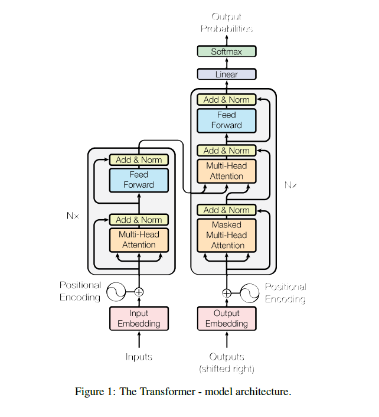

# VisionTransformer
This is implementation of a vision transformer , that basically uses the encoder part only of the Transformer .
For more clear unerstanding I have added comments on each step where I thought they are necessary .
You can play along with the hyperparameters and also you may consider adding a Learning Rate scheduler for keeping it high at the start and then lowering it to prevent Divergence .
You can also increase EPOCHS ( I used free GPU from colab so I could not train it to the end just stopped at 75% , but it was visible that the model was still not platued and converging after 20 Epochs ) 

